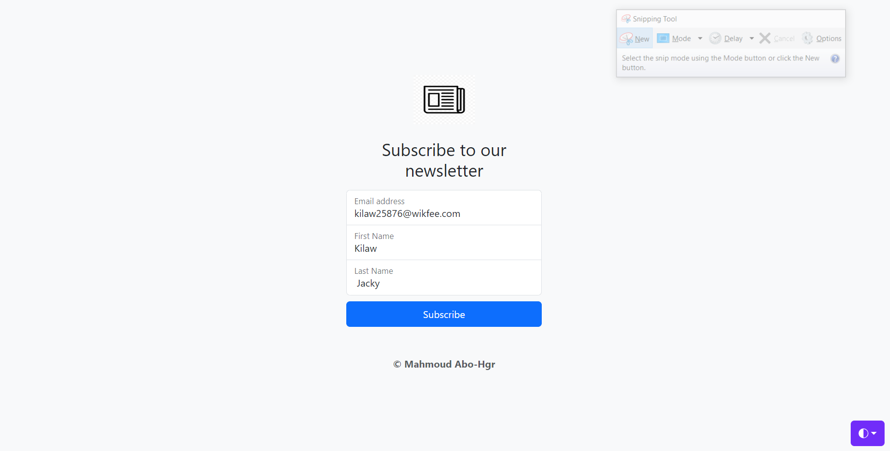
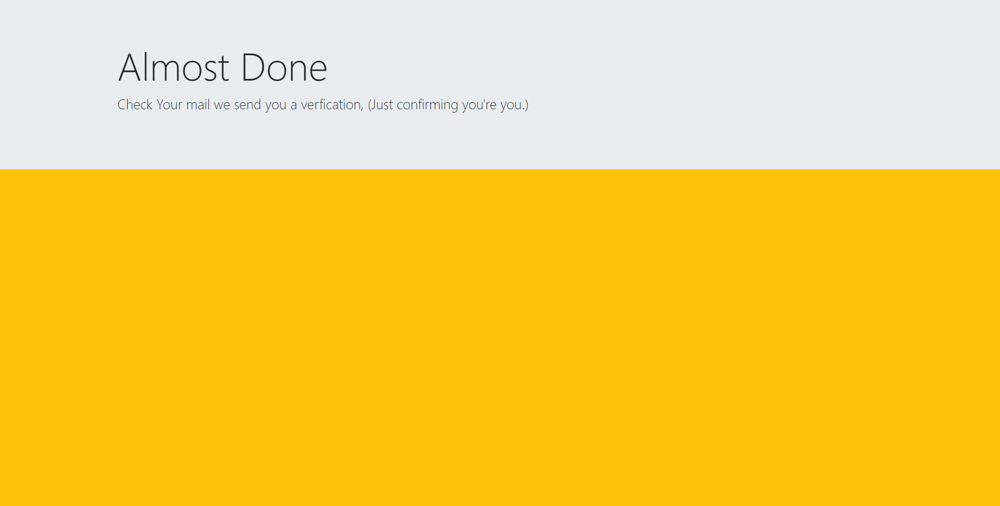
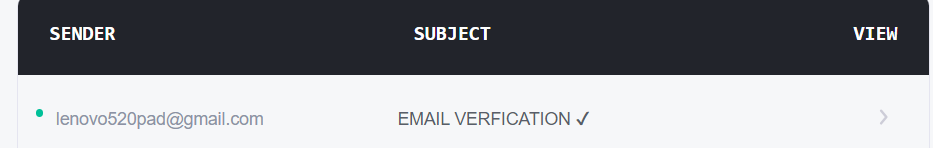
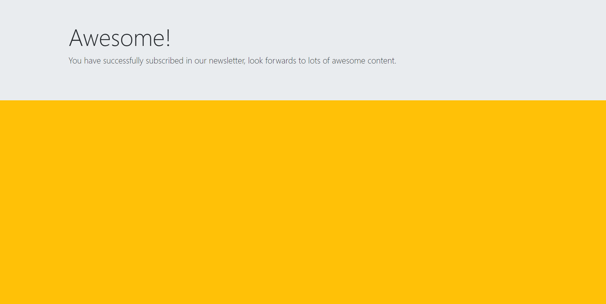
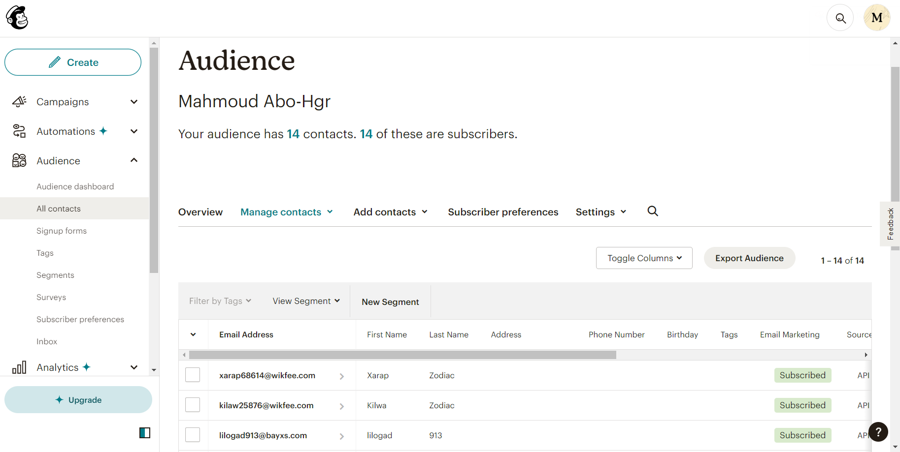

# News-Letter 
### website for collecting subscribtions for a news letter.
#### Backend developed using Node.JS, Express.JS, integrated with Mailchimp API to store the emails of the subscribed users and nodemailer used in verfying the submitted emails. 

by submiting an email it will be stored in your list at Mailchimp so you can use these emails later to inform it with your news, offers or sales. 
**Some Screenshots to visualize News-letter app:**
1. Home page

After submitting an email a verfication is required to continue
2. Verfication request page 

click on the link that was sent to the submitted email
3. Email verfication
 

after clicking on the verification link you will be redirected to a congratulations page.

4. Congratulations page 

all the submitted emails will be added to your audience list on mailchimp dashboard

5. MailChimp dashboard 

# Contact
* Email: ma5027300@gmail.com.
* LinkedIn: http://linkedin.com/in/mahmoudabohagr5027300
* Phone: +02-01102488789.

#### It's my pleasure to hear your feedback ☀️😊.

(<a href="#blog-app-api">back to top</a>)

